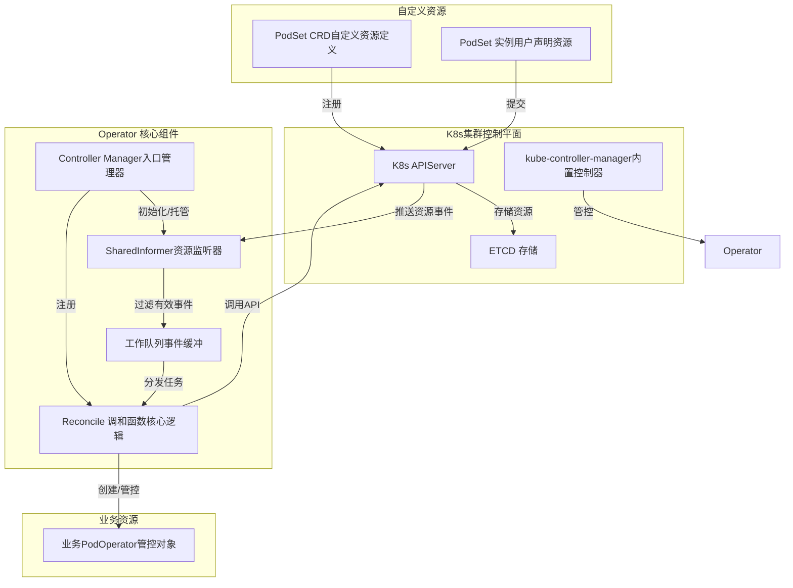
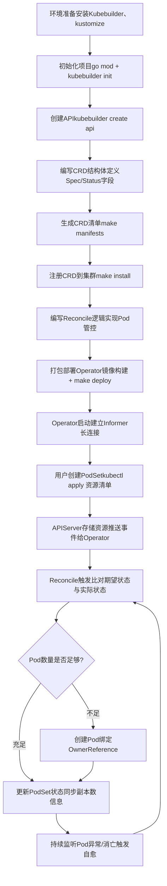

# Kubernetes Operator 完整详解（含核心机制与全流程）

## 一、Operator 核心定义与本质

Operator 是 Kubernetes 标准的扩展组件，基于 **CRD（自定义资源）+ Controller（控制器）** 模式实现，本质是**用户自定义的 Workload Controller**。

它将人工运维经验、标准化流程代码化，遵循**声明式API+调和循环（Reconcile Loop）**设计，持续保证用户声明的**期望状态**与集群**实际状态**一致，实现资源的全生命周期自动化管理。

### 核心定位区分

- **内置 Workload Controller**：K8s 官方原生，运行在 kube-controller-manager 中，管理 Deployment、StatefulSet、Pod 等标准资源

- **自定义 Operator**：用户/厂商开发，独立运行，管理 CRD 这类自定义资源，原理和内置控制器完全一致

---

## 二、Operator 核心组成

### 1. CRD（CustomResourceDefinition，自定义资源定义）

用于向 K8s 集群注册全新的资源类型，相当于给 K8s 新增一种“官方认可”的资源，比如 PodSet、MySQLCluster、vGPU 等。

CRD 包含两大核心字段：

- **Spec**：用户声明的**期望状态**（比如 PodSet 里的镜像地址、副本数量）

- **Status**：控制器维护的**实际状态**（比如当前运行的Pod数量、Pod名称列表）

### 2. Controller（控制器）

Operator 的核心逻辑载体，包含 **Reconcile 调和函数**，负责监听资源变化、比对状态、执行运维操作、更新资源状态。

### 3. 依赖框架

基于 K8s 官方 **controller-runtime** 框架开发，封装了 Informer、工作队列、缓存、认证等底层能力，无需手动实现。

---

## 三、PodSet Operator 完整开发与部署流程（含初始化命令）

### 步骤1：环境准备（必装工具）

先安装Kubebuilder、kustomize等必备工具，用于生成脚手架、渲染CRD配置，执行以下命令完成环境搭建：

```bash
# 安装 kubebuilder（Operator脚手架生成工具）
os=$(go env GOOS)
arch=$(go env GOARCH)
curl -L -o kubebuilder https://go.kubebuilder.io/dl/latest/${os}/${arch}
chmod +x kubebuilder && sudo mv kubebuilder /usr/local/bin/

# 安装 kustomize（CRD渲染部署工具）
curl -s "https://raw.githubusercontent.com/kubernetes-sigs/kustomize/master/hack/install_kustomize.sh"  | bash
sudo mv kustomize /usr/local/bin/

# 安装代码生成插件
go install sigs.k8s.io/controller-tools/cmd/controller-gen@latest
```

### 步骤2：初始化Operator项目脚手架（核心命令）

创建项目目录，执行初始化命令，生成标准化项目结构，定义API域名与Go模块路径。

```bash
# 创建并进入项目目录
mkdir -p podset-operator && cd podset-operator

# 初始化Go模块（替换为你的模块路径）
go mod init github.com/xxx/podset-operator

# 🔥 Kubebuilder初始化项目核心命令
kubebuilder init --domain example.com --repo github.com/xxx/podset-operator --skip-go-version-check

# 参数说明
# --domain：自定义CRD的域名后缀
# --repo：Go模块仓库路径，对应代码导入包名
```

执行完成后，生成标准目录结构：api（CRD定义）、config（部署配置）、controllers（控制器逻辑）、main.go（项目入口）。

### 步骤3：创建自定义API与CRD模板（核心命令）

通过命令生成PodSet自定义资源的API结构体、控制器模板，同步生成CRD基础配置文件。

```bash
# 🔥 创建PodSet API与控制器核心命令
kubebuilder create api --group batch --version v1 --kind PodSet --namespaced=true --resource=true --controller=true

# 参数说明
# --group：资源分组，最终CRD组为batch.example.com
# --version：API版本，固定为v1
# --kind：自定义资源类型，此处为PodSet
# --resource=true：生成CRD资源定义代码
# --controller=true：生成控制器调和模板代码
```

### 步骤4：定义CRD资源结构体（api/v1/podset_types.go）

修改自动生成的CRD代码，定义Spec（期望状态）和Status（实际状态）字段，规范资源格式。

```go
package v1

import (
	metav1 "k8s.io/apimachinery/pkg/apis/meta/v1"
)

// PodSetSpec 用户声明的期望状态
type PodSetSpec struct {
	// 副本数量，最小为1
	// +kubebuilder:validation:Minimum=1
	Replicas int32 `json:"replicas"`
	// 业务容器镜像地址
	Image string `json:"image"`
}

// PodSetStatus Operator维护的实际运行状态
type PodSetStatus struct {
	// 正常运行的Pod数量
	ReadyReplicas int32 `json:"readyReplicas,omitempty"`
	// 下属Pod名称列表
	PodNames []string `json:"podNames,omitempty"`
}

//+kubebuilder:object:root=true
//+kubebuilder:subresource:status
//+kubebuilder:printcolumn:name="Replicas",type="integer",JSONPath=".spec.replicas"
//+kubebuilder:printcolumn:name="Ready",type="integer",JSONPath=".status.readyReplicas"

type PodSet struct {
	metav1.TypeMeta   `json:",inline"`
	metav1.ObjectMeta `json:"metadata,omitempty"`
	Spec   PodSetSpec   `json:"spec"`
	Status PodSetStatus `json:"status,omitempty"`
}

//+kubebuilder:object:root=true
type PodSetList struct {
	metav1.TypeMeta `json:",inline"`
	metav1.ListMeta `json:"metadata,omitempty"`
	Items           []PodPodSet `json:"items"`
}

func init() {
	SchemeBuilder.Register(&PodSet{}, &PodSetList{})
}
```

### 步骤5：生成CRD清单文件

修改完CRD结构体后，执行命令生成最终CRD配置文件，无需手动编写YAML。

```bash
# 🔥 生成CRD清单命令
make manifests

# 作用：根据api目录下的结构体，自动渲染config/crd下的CRD配置
# 生成文件：config/crd/bases/batch.example.com_podsets.yaml
```

### 步骤6：注册CRD到K8s集群（make install）

将CRD配置提交到APIServer，让集群识别PodSet这种自定义资源，此步骤仅注册资源，不启动Operator。

```bash
# 🔥 注册CRD到集群核心命令
make install

# 底层等效命令
kustomize build config/crd | kubectl apply -f -

# 验证CRD注册结果
kubectl get crds | grep podsets
```

### 步骤7：编写控制器核心逻辑（controllers/podset_controller.go）

实现调和循环、Pod创建、状态更新、父子资源绑定逻辑，包含完整Reconcile函数与创建Pod方法。

```go
package controllers

import (
	"context"
	"fmt"

	corev1 "k8s.io/api/core/v1"
	"k8s.io/apimachinery/pkg/api/errors"
	metav1 "k8s.io/apimachinery/pkg/apis/meta/v1"
	"k8s.io/apimachinery/pkg/runtime"
	ctrl "sigs.k8s.io/controller-runtime"
	"sigs.k8s.io/controller-runtime/pkg/client"
	"sigs.k8s.io/controller-runtime/pkg/log"

	batchv1 "github.com/xxx/podset-operator/api/v1"
)

// PodSetReconciler 调和器结构体
// 负责实现PodSet资源的调和逻辑，管控下属Pod生命周期
type PodSetReconciler struct {
	client.Client
	Scheme *runtime.Scheme
}

//+kubebuilder:rbac:groups=batch.example.com,resources=podsets,verbs=get;list;watch;create;update;patch;delete
//+kubebuilder:rbac:groups=batch.example.com,resources=podsets/status,verbs=get;update;patch
//+kubebuilder:rbac:groups=core,resources=pods,verbs=get;list;watch;create;delete

// Reconcile 核心调和函数
// 由controller-runtime框架自动调度触发，实现期望状态与实际状态的同步
func (r *PodSetReconciler) Reconcile(ctx context.Context, req ctrl.Request) (ctrl.Result, error) {
	log := log.FromContext(ctx)

	// 第一步：获取当前命名空间下的PodSet资源实例
	var podSet batchv1.PodSet
	if err := r.Get(ctx, req.NamespacedName, &podSet); err != nil {
		// 资源已删除，直接退出，无需处理
		if errors.IsNotFound(err) {
			return ctrl.Result{}, nil
		}
		log.Error(err, "获取PodSet资源失败")
		return ctrl.Result{}, err
	}

	// 第二步：查询归属当前PodSet的所有Pod
	// 通过标签筛选，保证只获取当前资源管控的Pod
	var podList corev1.PodList
	labelSelector := client.MatchingLabels{"podset-name": podSet.Name}
	if err := r.List(ctx, &podList, client.InNamespace(req.Namespace), labelSelector); err != nil {
		log.Error(err, "查询下属Pod列表失败")
		return ctrl.Result{}, err
	}

	// 第三步：比对实际副本数与期望副本数，执行扩缩容
	currentReplicas := int32(len(podList.Items))
	desiredReplicas := podSet.Spec.Replicas

	// 实际副本数不足，创建缺失的Pod
	if currentReplicas < desiredReplicas {
		if err := r.createPod(ctx, &podSet); err != nil {
			log.Error(err, "创建Pod失败")
			return ctrl.Result{}, err
		}
	}

	// 第四步：更新PodSet状态，同步运行数据
	podSet.Status.ReadyReplicas = currentReplicas
	// 收集所有下属Pod名称
	var podNames []string
	for _, pod := range podList.Items {
		podNames = append(podNames, pod.Name)
	}
	podSet.Status.PodNames = podNames

	// 将更新后的状态提交至APIServer
	if err := r.Status().Update(ctx, &podSet); err != nil {
		log.Error(err, "更新PodSet状态失败")
		return ctrl.Result{}, err
	}

	log.Info("调和完成", "期望副本数", desiredReplicas, "实际副本数", currentReplicas)
	return ctrl.Result{}, nil
}

// createPod 创建归属当前PodSet的子Pod
// 绑定OwnerReference，实现父子资源关联与级联删除
func (r *PodSetReconciler) createPod(ctx context.Context, podSet *batchv1.PodSet) error {
	// 定义Pod模板，使用PodSet配置的镜像
	pod := &corev1.Pod{
		ObjectMeta: metav1.ObjectMeta{
			GenerateName: podSet.Name + "-pod-",
			Namespace:    podSet.Namespace,
			// 打上专属标签，用于后续筛选
			Labels: map[string]string{
				"podset-name": podSet.Name,
			},
		},
		Spec: corev1.PodSpec{
			Containers: []corev1.Container{
				{
					Name:  "app",
					Image: podSet.Spec.Image,
				},
			},
		},
	}

	// 核心：建立父子资源绑定，设置所有者引用
	if err := ctrl.SetControllerReference(podSet, pod, r.Scheme); err != nil {
		return fmt.Errorf("设置OwnerReference失败: %v", err)
	}

	// 创建Pod到K8s集群
	return r.Create(ctx, pod)
}

// SetupWithManager 注册控制器
// 将当前调和器注册到Manager，绑定监听的资源
func (r *PodSetReconciler) SetupWithManager(mgr ctrl.Manager) error {
	return ctrl.NewControllerManagedBy(mgr).
		// 监听主资源：PodSet
		For(&batchv1.PodSet{}).
		// 监听从属资源：Pod，通过OwnerReference过滤
		Owns(&corev1.Pod{}).
		Complete(r)
}
```

### 步骤8：Operator项目入口（main.go）

Operator启动入口，初始化管理器、注册控制器，由main函数手动调用SetupWithManager完成监听注册。

```go
package main

import (
	"os"
	"k8s.io/apimachinery/pkg/runtime"
	utilruntime "k8s.io/apimachinery/pkg/util/runtime"
	clientgoscheme "k8s.io/client-go/kubernetes/scheme"
	ctrl "sigs.k8s.io/controller-runtime"
	"sigs.k8s.io/controller-runtime/pkg/log/zap"

	batchv1 "github.com/xxx/podset-operator/api/v1"
	"github.com/xxx/podset-operator/controllers"
)

var (
	scheme   = runtime.NewScheme()
	setupLog = ctrl.Log.WithName("setup")
)

func init() {
	utilruntime.Must(clientgoscheme.AddToScheme(scheme))
	utilruntime.Must(batchv1.AddToScheme(scheme))
}

func main() {
	ctrl.SetLogger(zap.New(zap.UseDevMode(true)))

	// 创建Manager管理器
	mgr, err := ctrl.NewManager(ctrl.GetConfigOrDie(), ctrl.Options{
		Scheme:         scheme,
		LeaderElection: false,
	})
	if err != nil {
		setupLog.Error(err, "create manager failed")
		os.Exit(1)
	}

	// 注册控制器
	if err = (&controllers.PodSetReconciler{
		Client: mgr.GetClient(),
		Scheme: mgr.GetScheme(),
	}).SetupWithManager(mgr); err != nil {
		setupLog.Error(err, "register controller failed")
		os.Exit(1)
	}

	// 启动Operator
	setupLog.Info("starting operator")
	if err := mgr.Start(ctrl.SetupSignalHandler()); err != nil {
		setupLog.Error(err, "operator running failed")
		os.Exit(1)
	}
}
```

### 步骤9：运行与部署Operator

#### 本地调试模式

```bash
# 本地启动Operator，连接K8s集群
make run
```

#### 集群部署模式

```bash
# 构建并推送镜像
make docker-build docker-push IMG=xxx/podset-operator:v1

# 部署Operator到集群
make deploy IMG=xxx/podset-operator:v1

# 查看Operator运行状态
kubectl get pods -n podset-operator-system
```

### 步骤10：测试验证

编写PodSet资源YAML，创建资源验证Operator自动拉起Pod、故障自愈能力。

```yaml
apiVersion: batch.example.com/v1
kind: PodSet
metadata:
  name: podset-sample
spec:
  replicas: 3
  image: nginx:alpine
```

```bash
# 创建资源
kubectl apply -f config/samples/batch_v1_podset.yaml

# 查看资源状态
kubectl get podsets
kubectl get pods
```

---

## 四、Operator 架构与流程可视化

### 4.1 Operator 整体架构图（组件交互）

本图清晰展示Operator内部组件、K8s集群组件的层级关系与交互链路，直观呈现数据流向与职责划分。


### 4.2 PodSet Operator 全流程流程图

覆盖从项目初始化、CRD部署、Operator运行到资源自愈的全生命周期，步骤清晰、逻辑闭环。


---

## 五、Operator 核心工作机制（全程闭环）

### 1. 启动阶段：建立监听长连接

Operator 启动后，controller-runtime 框架自动创建 **Informer（监听器）**，主动向 APIServer 发起**HTTPS 长连接监听**，携带 watch=true 参数，开启流式监听。

### 2. 事件监听：Watch 长连接原理

该长连接基于 **HTTP/1.1 分块传输编码（Chunked）** 实现，并非 WebSocket，也不是 APIServer 主动回调：

- Operator 主动发起带 watch=true 的 HTTPS GET 请求

- APIServer 响应后保持连接不关闭，有资源变化时，通过该连接**流式推送事件数据**

- 连接断开后，框架会自动重试，携带 resourceVersion 保证不丢事件

### 3. 事件过滤：OwnerReference 机制

Owns 方法会监听集群内**所有Pod**，但不会被海量无关事件干扰，核心靠 **OwnerReference（父子资源绑定）** 过滤：

- 创建子Pod时，通过 SetControllerReference 给Pod添加父资源标识，相当于给Pod上“户口”

- Informer 收到Pod事件后，检查 OwnerReference 字段，只处理归属当前PodSet的Pod，无关事件直接丢弃

- 依托该机制可实现**级联删除**：删除父资源PodSet时，K8s会自动清理所有绑定的子Pod，无需手动处理

### 4. 性能保障：SharedInformer 共享监听

集群内所有控制器共享一条 Pod 监听长连接，而非每个 Operator 单独监听，事件先存入本地缓存，再分发处理，大幅降低 APIServer 压力和网络开销，海量Pod场景下也能稳定运行。

### 5. 事件处理：工作队列 + Reconcile 调用

1. 有效事件经 Informer 处理后，存入 Operator 内部**工作队列**

2. 工作协程循环从队列取出任务，**框架自动调用 Reconcile 函数**

3. Reconcile 比对期望状态和实际状态，执行对应操作（创建/删除Pod、更新状态等）

4. 执行完毕后，根据结果决定是否重新入队重试

### 6. 完整流程：创建 PodSet 到拉起Pod

1. kubectl apply 创建 PodSet，请求提交至 APIServer，存入 ETCD

2. Operator 的 Informer 通过长连接感知 PodSet 创建事件

3. 事件入队，框架调用 Reconcile 函数

4. Reconcile 检测到仅有 PodSet，无对应Pod，发起创建Pod请求

5. Scheduler 调度Pod到合适节点，kubelet 运行Pod

6. Operator 持续监听Pod状态，Pod消亡时触发自愈，重新创建Pod

---

## 六、Operator 运行与生命周期

### 1. 运行形态

生产环境中，Operator 被打包为容器镜像，以**Deployment 资源** 部署在集群中，最终运行形式是**普通Pod**，和业务Pod无任何区别。

### 2. 生命周期管理

Operator 自身的生命周期，由 K8s **内置 Workload Controller（DeploymentController）** 管理：

- Operator Pod 宕机，自动重建自愈

- 支持副本控制、滚动更新、扩缩容

- 删除 Deployment 时，自动清理 Operator Pod

### 3. 运行节点

**无需强制部署在Master节点**，可运行在集群任意Worker/Master节点，只需网络能访问 APIServer 即可。Master节点仅运行 kube-apiserver、etcd 等控制平面组件，Operator 不属于控制平面组件。

---

## 七、易混淆概念清晰区分

### 1. Operator vs Workload Controller

|对比项|内置 Workload Controller|自定义 Operator|
|---|---|---|
|开发者|K8s 官方|用户/第三方厂商|
|运行位置|kube-controller-manager|独立Pod/本地进程|
|管理对象|标准资源（Pod、Deployment等）|自定义CRD资源|
|核心原理|调和循环、声明式管理|与内置控制器完全一致|
### 2. Operator vs Scheduler Extender

- **Operator**：管**资源全生命周期**（创建、自愈、运维），不参与调度

- **Scheduler Extender**：是原生调度器的外挂插件，**只管调度**（决定Pod跑在哪个节点），不管理资源生命周期

### 3. 自定义调度器 vs Scheduler Extender

- **Scheduler Extender**：增强原生调度器，不替换原有组件

- **自定义调度器**：全新开发的独立调度器，可替换原生 kube-scheduler（如 Volcano）

---

## 八、常见误区纠正

**误区1：APIServer 主动回调 Operator 的 Reconcile 函数**

真相：Reconcile 由 Operator 内部框架主动调用，Operator 主动监听 APIServer，APIServer 仅通过长连接推送事件，不主动调用控制器。

**误区2：Operator 必须运行在Master节点**

真相：Operator 是普通Pod，可运行在集群任意节点，只需能访问 APIServer 即可。

**误区3：Owns 只监听归属当前资源的Pod**

真相：Owns 监听集群所有Pod，本地通过 OwnerReference 过滤，仅处理自身子资源。

**误区4：自定义调度器 = Scheduler Extender**

真相：Scheduler Extender 是调度器插件，自定义调度器是独立全新调度器，二者完全不同。

---

## 九、总结

Operator 是 K8s 最核心的扩展方式，本质是**自定义的 Workload Controller**，依托 CRD 实现资源扩展，通过 HTTPS 长连接监听资源变化，借助 OwnerReference 实现精准事件管控，依靠调和循环完成自治运维。

它的设计遵循 K8s 递归自治思想：内置控制器管理 Operator 本身，Operator 管理自定义业务资源，全程实现无人工干预的自动化运维，是云原生有状态应用、中间件、异构资源管理的标准方案。

<!--stackedit_data:
eyJoaXN0b3J5IjpbLTUzOTUzOTEwOSw2OTAzNjg3NTVdfQ==
-->